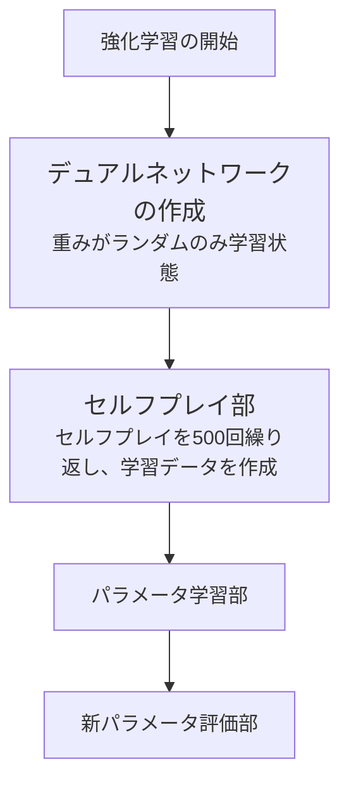
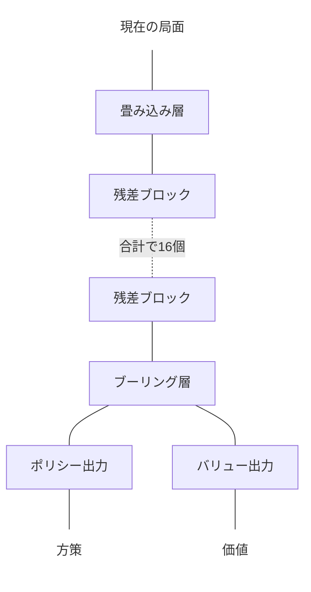
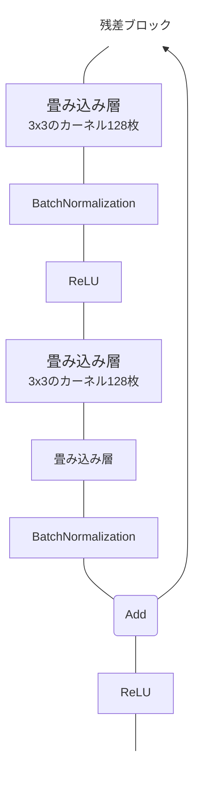

# AlphaZeroによるオセロの強化学習要素

|強化学習の要素 |オセロ|
|-------------|----|
|目的|勝つ|
|エピソード|終局まで|
|状態|局面|
|行動|手を打つ|
|報酬|勝ったら+1、負けたら-1|
|学習手法|モンテカルロ木探索+ResNet+セルフプレイ|
|パラメータの更新|1エピソードごと|

# 強化学習サイクル

# ファイル構成
|ファイル名|説明|
|--------|----|
|game.rs|ゲーム状態|
|dual_network.rs|デュアルネットワーク|
|pv_mcts.rs|モンテカルロ木探索|
|self_play.rs|セルフプレイ部|
|train_network.rs|パラメータ更新部|
|evaluate_network.rs|新パラメータ評価部|
|train_cycle.rs|学習サイクルの実行|
|human_play.rs|ゲームUI|

# デュアルネットワークの作成
ResNetをモデルのベースとする

<html>
<body>
    

        <h2>デュアルネットワークの入力</h2>
        <ul>
            <li>自分の石の配置(8x8の2次元配列)</li>
            <li>相手の石の配置(8x8の2次元配列)</li>
        </ul>
        <h2>デュアルネットワークの出力</h2>
        <ul>
            <li>方策 (要素が65で、要素の値の合計が「1」の配列)</li>
            <li>価値 (0 ~ 1の値を持つ長さ「1」の配列)</li>
        </ul>
    

</body>
</html>

